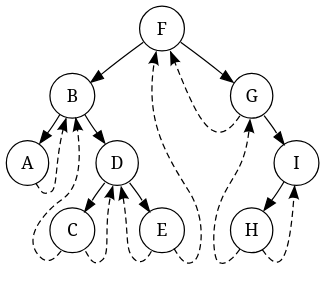

# Threaded Binary Tree
In a regular binary tree, the inorder traversal requires recursion or it requires a stack. 

A threaded binary tree is a type of binary tree where the NULL pointers of the leaf node are made to point to the inorder successor of the leaf node. This means we can traverse the tree without recursion or a stack.

Threaded binary trees reduce the space complexity, but are more complex to implement than standard binary trees.

There are two types of threaded binary trees: single threaded and double threaded. The only difference between the two is that one contains a pointer only to the inorder successor, while the other contains a pointer to both inorder successor and predecessor.



The following code describes the implementation of a single-threaded node in C.
```c
typedef struct Node 
{
    int data;
    struct Node* left;
    struct Node* right;
    int rightThread;
} Node;

Node* createNode(int val) 
{
    Node* newNode = (Node*) malloc(sizeof(Node));
    if(newNode != NULL)
    {
        newNode->data = val;
        newNode->left = NULL;
        newNode->right = NULL;
        newNode->rightThread = 0;
    }

    return newNode;
}
```
The boolean rightThread indicates whether the right pointer points to the inorder successor or the right child.

This is the code for inorder traversal:
```C
Node* leftMost(Node* n)
{
    if(n == NULL)
        return NULL;

    while(n->left != NULL)
        n = n->left;

    return n;
}

void inOrder(Node* root)
{
    Node* cur = leftMost(root);
    while (cur != NULL)
    {
        printf("%d ", cur->data);

        if(cur->rightThread)
            cur = cur->right;
        else
            cur = leftMost(cur->right);
    }
}
```

The algorithm is simple:
1. Go the the left most node from the root.
2. Print the value of the node.
3. If the node has a right thread, follow that thread.
4. Else, go to the left most chiif(cur->rightThread)ld of the right child.
5. Repeat steps 2, 3 and 4 while the node is not NULL.

### Advantages 
- Enables linear traversal of elements.
- Eliminates use of stack.
- Can find parent without a parent pointer.
- For a given node, you can easily find inorder successor.
- No NULL pointer is present, hence memory is not wasted.

### Disadvantages
- Needs extra memory to indicate threading.
- Insertion and deletion are complex.
- Limited flexibility
- Difficulty in parallelization.

### Applications
- Expression evaluation
- Database indexing
- Symbol table management
- Disk-based data structures
